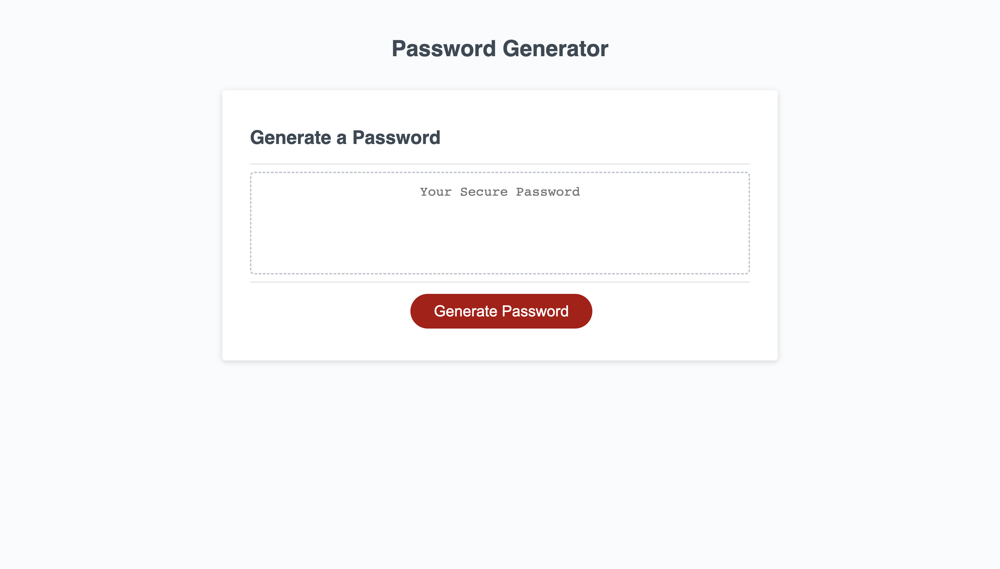
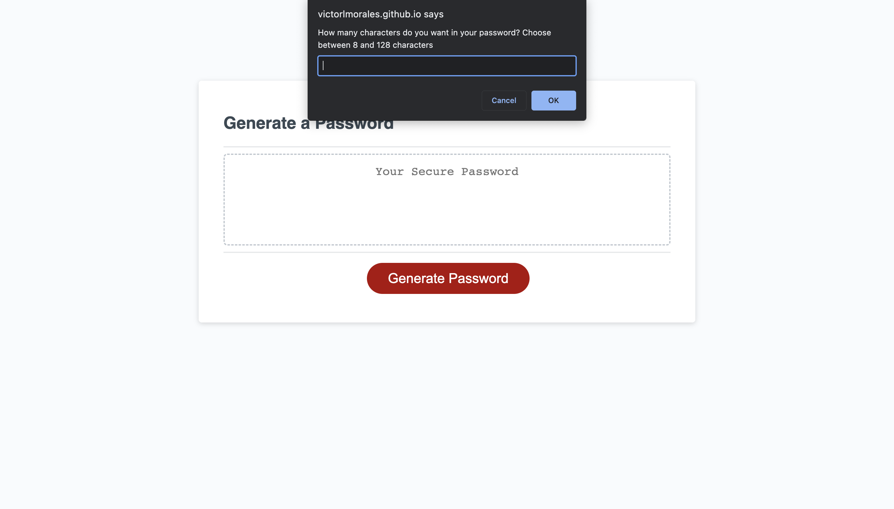
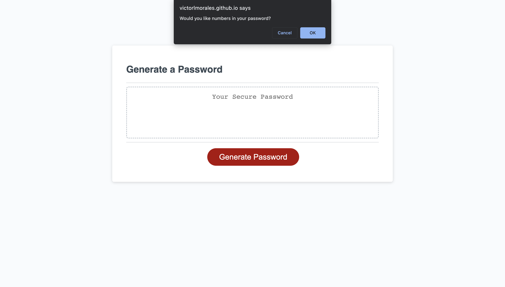
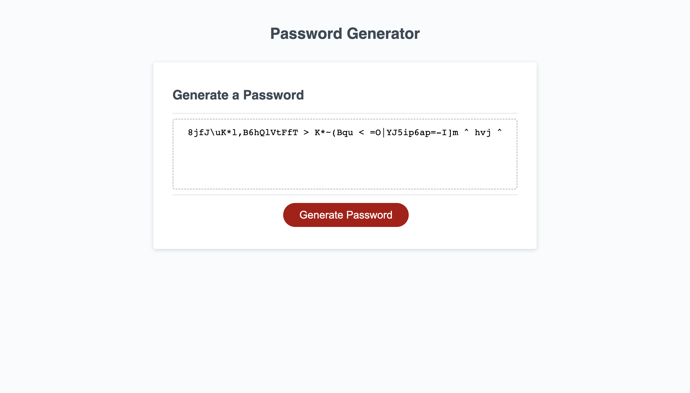

# Password-Generator
This application will generate a password with criteria that the user wishes to include.

## Features
There is four criterias to choose from; lowercase characters, uppercase charcaters, numbers, and symbols. 

User has to choose at least one criteria to generate a password. 

If no criteria is chosen an error will be generated

If an incorrect data type is inputed an error will be generated.

If the length of the password is less than 8 or greater than 128 charcaters, an error will be generated

## Usage
* Open Link Url
* Click Generate Password
* Choose the Length of the Password
* Choose what criteria to include in your password
A Password will be genrated upon completion

## Links

* [Deployed Application URL](https://victorlmorales.github.io/password-generator/)

## Screenshots
* Initial Prompt

* Length of Password Prompt

* Lower Case Prompt

* Upper Case Prompt

* Numbers Prompt

* Symbols Prompt

* Generated Password Example

## License

This project is covered under the MIT License. (Refer to the LICENSE file)
